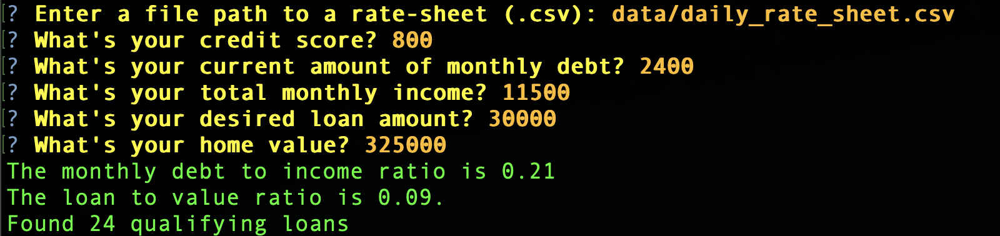

# Loan Qualifier Application

This application was inspired by my previous loan valuation program in Python. It is intended to be an app for a user who wants to be matched with a qualifying loan from the bank. Based on the user's financial standing and their inputs into the application, the program will decide whether or not they qualify, and if so, will match them with a list of appropriate loans. The user will also be able to save their results by exporting their loan information into a csv file, if they would like.

---

## Technologies

This application is written in Python 3.7. It was written in the text editor Visual Studio Code Version: 1.65.2 (Universal). The program was run & debugged using the Terminal in MAC OS Monterey 12.2.1. The Python libraries used in this application are Fire and Questionary. Documentation shown below:

[Fire](https://google.github.io/python-fire/guide/)

[Questionary](https://questionary.readthedocs.io/en/stable/)

---

## Installation Guide

To run this program, the user must first install the Fire and Questionary libraries. To do so, the user should perform the following commands in the Terminal.

> pip install fire

> pip install questionary

The program also is written to reference specific bank loan data within the directory. To reference this data, when prompted for file path to rate sheet please enter:

> data/daily_rate_sheet.csv

---

## Usage

This project's usage is dependent on the users interaction with the program and the prompts. When run, the program will ask the user a series of questions (shown in yellow) to which they will answer by typing into the command-line (answers shown in orange). This is how the interface looks when the user does qualify for a loan:

The program will then ask the user whether or not they would like to save their results as shown below:

If the user inputs their financial information but does not qualify, the program will exit as shown below:

---

## Contributors

Arlie Jones

[E-mail](arliejones98@gmail.com)

[LinkedIn](https://www.linkedin.com/in/arlie-jones-020092159/)

Starter Code issued by [UC Berkeley Extension](https://bootcamp.berkeley.edu/fintech/).

---

## License

None
